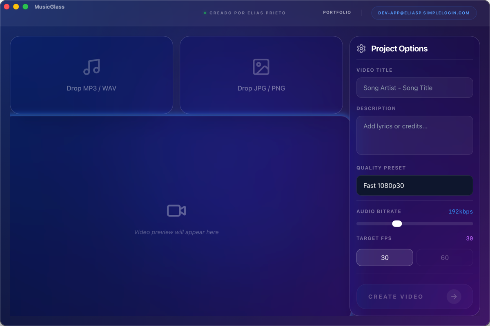

# 💎 MusicGlass
### Modern macOS Video Creator (Static Image + Audio → MP4)
Built with **Tauri v2**, **SvelteKit**, and **Rust**.

<p align="center">
  
</p>

MusicGlass is a lightweight, open-source desktop application for macOS designed to convert audio tracks (MP3/WAV) and a cover image into a high-quality static MP4 video, optimized for YouTube.


---

## 🚀 Features
- **Liquid Glass UI**: Modern glassmorphism design (Apple Control Center style).
- **Drag & Drop**: Seamlessly add audio and cover art.
- **Smart Metadata**: Automatic extraction of artist/title from ID3 tags.
- **Progress Tracking**: Real-time encoding updates.
- **Native Performance**: Ultra-fast Rust backend with async processing.
- **Open Source**: MIT licensed, clean, and extensible.

---

## 🔧 Prerequisites
To build or run this application, ensure you have the following installed:
1. **Rust & Tauri v2 SDK**: [Install Rust](https://www.rust-lang.org/tools/install)
2. **FFmpeg & HandBrakeCLI**:
   ```bash
   brew install ffmpeg handbrake
   ```
3. **Node.js & pnpm**: 
   ```bash
   brew install node pnpm
   ```

---

## 🛠️ Installation & Development
1. **Clone the repository**:
   ```bash
   git clone https://github.com/yourusername/musicglass.git
   cd musicglass
   ```

2. **Install dependencies**:
   ```bash
   pnpm i
   ```

3. **Run in development mode**:
   ```bash
   pnpm tauri dev
   ```

4. **Build the production .app**:
   ```bash
   pnpm tauri build
   ```

---

## 📂 Tech Stack
- **Frontend**: [SvelteKit](https://kit.svelte.dev/), [TailwindCSS](https://tailwindcss.com/)
- **Backend**: [Tauri v2](https://v2.tauri.app/), [Rust](https://www.rust-lang.org/)
- **Video Engine**: FFmpeg (Looping) + HandBrakeCLI (Fast Encoding)
- **Icons**: [lucide-svelte](https://lucide.dev/)
- **Metadata**: [music-metadata-browser](https://github.com/borewit/music-metadata-browser)

---

## 📄 License
MusicGlass is released under the **MIT License**. See `LICENSE` for details.

---
*Created with ❤️ for the YouTube Creator Community.*
