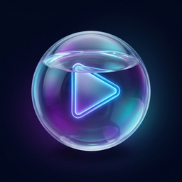

<p align="center">
  
</p>

# 💎 MusicGlass
### The Premium macOS Video Creator for Musicians
**Static Image + Audio → High-Fidelity MP4**

---

<p align="center">
  
</p>

<p align="center">
  <a href="https://github.com/eliasbuenosdias/music-glass/releases/latest">
    
  </a>
  
  
</p>

---

## 📥 Download
Choose the installer for your platform from our **[Latest Releases](https://github.com/eliasbuenosdias/music-glass/releases/latest)**:

| Platform    | Format               | Link                                                                                   |
| :---------- | :------------------- | :------------------------------------------------------------------------------------- |
| **macOS**   | `.dmg` / `.app`      | [Download for Mac](https://github.com/eliasbuenosdias/music-glass/releases/latest)     |
| **Windows** | `.msi` / `.exe`      | [Download for Windows](https://github.com/eliasbuenosdias/music-glass/releases/latest) |
| **Linux**   | `.AppImage` / `.deb` | [Download for Linux](https://github.com/eliasbuenosdias/music-glass/releases/latest)   |

---

## ✨ Overview
**MusicGlass** is a minimalist, high-performance desktop application designed for musicians and creators who need to turn their tracks into beautiful, social-media-ready videos. No more fighting with complex video editors—just drag, drop, and export.

### 🎭 Premium Aesthetics
- **Liquid Glass UI**: Fully integrated with the macOS design language (Vibrancy & Vitality).
- **Micro-animations**: Smooth transitions and hover effects for a premium feel.
- **Smart Logic**: Automatically detects artist and song titles from your files.

---

## 🚀 Core Features
| Feature                 | Description                                                      |
| :---------------------- | :--------------------------------------------------------------- |
| **Ultra-Fast Encoding** | Leverages Rust & HandBrakeCLI for lightning-fast MP4 generation. |
| **Retina UI**           | High-DPI support with glassmorphism effects throughout the app.  |
| **Drag & Drop**         | Intuitive workspace for audio (MP3/WAV) and cover art (JPG/PNG). |
| **One-Click Export**    | Optimized for YouTube, Instagram, and TikTok formats.            |
| **Native Performance**  | Zero-lag interface built with the latest Tauri v2 framework.     |

---

## 🔧 Prerequisites
To use or build **MusicGlass**, you need:
1. **FFmpeg & HandBrakeCLI**:
   ```bash
   brew install ffmpeg handbrake
   ```
2. **macOS 10.15+**: Optimized for Apple Silicon and Intel.

---

## 🛠️ Development
```bash
# Clone the repository
git clone https://github.com/eliasbuenosdias/music-glass.git

# Install dependencies
pnpm install

# Run in development mode
pnpm tauri dev

# Build production bundle
pnpm tauri build
```

---

## 📂 Architecture
*   **Frontend**: SvelteKit + TailwindCSS (Glassmorphism engine).
*   **Backend**: Rust (High-concurrency video processor).
*   **Release**: Automated GitHub Actions for macOS, Windows, and Linux.

---

<p align="center">
  Creado con ❤️ por <b>Elias Prieto</b><br/>
  <a href="https://eliasbuenosdias.github.io/Elias-Porfolio/">Portfolio</a> • <a href="mailto:dev-app@eliasp.simplelogin.com">Contacto</a>
</p>
